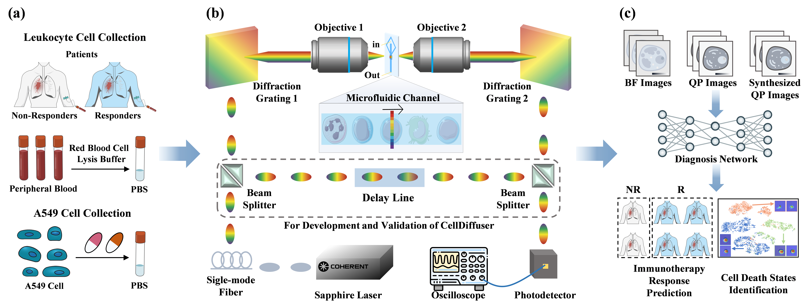

# CellDiffuser: Multimodal Optical Time-Stretch Imaging Flow Cytometry and Diffusion Models for Lung Cancer Immunotherapy Diagnosis

⭐ This code has been completely released ⭐ 

## Overview

<p align='center'>
    
</p>

Fig. 1. Framework of lung cancer immunotherapy diagnosis. (a) Sample collection and preparation. (b) Structure diagram of the multimodal OTS-IFC. (c) Application of lung cancer immunotherapy diagnosis using BF, QP, and synthesized QP cell images.

### Requirements

This repository is based on PyTorch 2.4.0, CUDA 12.6 and Python 3.10.9. All experiments in our manuscript were conducted on NVIDIA GeForce RTX A6000 GPU with an identical experimental setting.

### Dataset Construction

The dataset needs to be divided into two folders for training and test. The training data should be in the format as follows:

CellDiffuser
├── A549 Cell Death State Identification Dataset
│   ├── train
│   │   ├── Control
│   │   │   ├── inten
│   │   │   │   ├── 1.tif
│   │   │   │   ├── 2.tif
│   │   │   │   ├── ...
│   │   │   ├── pha
│   │   │   │   ├── 1.tif
│   │   │   │   ├── 2.tif
│   │   │   │   ├── ...
│   │   ├── Autophagy
│   │   │   ├── inten
│   │   │   │   ├── 1.tif
│   │   │   │   ├── 2.tif
│   │   │   │   ├── ...
│   │   │   ├── pha
│   │   │   │   ├── 1.tif
│   │   │   │   ├── 2.tif
│   │   │   │   ├── ...
│   │   ├── Apoptosis
│   │   │   ├── inten
│   │   │   │   ├── 1.tif
│   │   │   │   ├── 2.tif
│   │   │   │   ├── ...
│   │   │   ├── pha
│   │   │   │   ├── 1.tif
│   │   │   │   ├── 2.tif
│   │   │   │   ├── ...
│   ├── inference
│   │   ├── Control
│   │   │   ├── inten
│   │   │   │   ├── 1.tif
│   │   │   │   ├── 2.tif
│   │   │   │   ├── ...
│   │   │   ├── pha
│   │   │   │   ├── 1.tif
│   │   │   │   ├── 2.tif
│   │   │   │   ├── ...
│   │   ├── Autophagy
│   │   │   ├── inten
│   │   │   │   ├── 1.tif
│   │   │   │   ├── 2.tif
│   │   │   │   ├── ...
│   │   │   ├── pha
│   │   │   │   ├── 1.tif
│   │   │   │   ├── 2.tif
│   │   │   │   ├── ...
│   │   ├── Apoptosis
│   │   │   ├── inten
│   │   │   │   ├── 1.tif
│   │   │   │   ├── 2.tif
│   │   │   │   ├── ...
│   │   │   ├── pha
│   │   │   │   ├── 1.tif
│   │   │   │   ├── 2.tif
│   │   │   │   ├── ...

CellDiffuser
├── Leukocyte Cell Immunotherapy Response Prediction Dataset
│   ├── Non-Responders
│   │   ├── Patient1
│   │   │   ├── inten
│   │   │   │   ├── 1.tif
│   │   │   │   ├── 2.tif
│   │   │   │   ├── ...
│   │   │   ├── pha
│   │   │   │   ├── 1.tif
│   │   │   │   ├── 2.tif
│   │   │   │   ├── ...
│   │   ├── ...
│   ├── Responders
│   │   ├── Patient1
│   │   │   ├── inten
│   │   │   │   ├── 1.tif
│   │   │   │   ├── 2.tif
│   │   │   │   ├── ...
│   │   │   ├── pha
│   │   │   │   ├── 1.tif
│   │   │   │   ├── 2.tif
│   │   │   │   ├── ...
│   │   ├── ...

Note that the **Leukocyte Cell Immunotherapy Response Prediction Dataset** and **A549 Cell Death State Identification Dataset** can be made available to qualified researchers upon a formal and reasonable request to the corresponding author.

### Train

Modify the parameters in lines 18 to 27 of the options/base_options.py, then simply run:

```python
python train.py
```

### Inference
Modify the parameters in lines 7 to 44 of the options/test_options.py, then simply run:

```
python inference.py
```

### Application of Lung Cancer Immunotherapy Diagnosis
To facilitate the application of lung cancer immunotherapy diagnosis, we provide the modified MambaVision implementation in the **"MambaVision.py"**.
